sidebar_position: 4
title: Deploy
-------------

- Deployment of ink! based smart contracts

This document contains description of how to deploy and test smart contracts locally and in testnet.

### Ecosystem

Polkadot doesn't support smart contract execution, only parachains can provide this functionality. More information
about how it works you can find on [official wiki](https://wiki.polkadot.network/docs/en/build-smart-contracts).

The list of standalone blockchain/parachains that support ink! smart contracts:

* [Edgeware](https://edgewa.re)
* [Astar](https://astar.network/)

### Overview

- [Clone](#Clone)
- Here you can find how to [Build](#Build) **ink!** smart contract
- Let's [deploy to local network](#Deployment-on-local-network)
- You can manuly [call](#Call-the-smart-contract) our deployed contract
- [Canvas](https://github.com/paritytech/cumulus#canvas-) - a Smart Contracts [Parachain](https://wiki.polkadot.network/docs/learn-parachains) which was deployed on [Polkadot](https://polkadot.network/ru/) test network - [Rococo](https://polkadot.network/tag/rococo/)
- How to deploy ink! smart contract to [canvas](#Deploy-to-Canvas)
- How to get free `ROC` token using [faucet](#Rococo-Faucet) to deploy contract to Canvas network
- [Astar](#Astar) - [WASM](https://webassembly.org/) + [EVM](https://ethereum.org/en/developers/docs/evm/) Hub on [Polkadot](https://polkadot.network/). More info about astar [here](https://docs.astar.network/)
- You can deploy **ink!** smart contract to [Shibuya](#Deploy-to-Shibuya) (astar test network). How to get free `SBY` using [faucet](https://docs.astar.network/integration/testnet-faucet)

### Clone

Clone repository [openbrush](https://github.com/Supercolony-net/openbrush-contracts.git)

### Build

- navigate to `./openbrush/examples/psp22`
- build ink! contract using:

```
cargo +nightly contract build
```

Once the compilation is completed, a target folder is created. In this folder, under the ink subdirectory, you will be able to see a my_psp22.wasm file and a `metadata.json` file. my_psp22.wasm is your contract that has been compiled to web assembly and the `metadata.json` is a JSON abstraction of your contract.

You will find 3 files in folder `./openbrush/examples/psp22/target/ink`

- `my_psp22.contract` (code + metadata)
- `my_psp22.wasm` (the contract’s code)
- `metadata.json` (the contract’s metadata)

### Deployment on local network

- Run local substrate node

```
substrate-contracts-node --dev
```

- Navigate to the [Contracts UI](https://paritytech.github.io/contracts-ui) in a web browser :
- Verify that you are connected to the [Local Node](https://github.com/substrate-developer-hub/substrate-node-template).

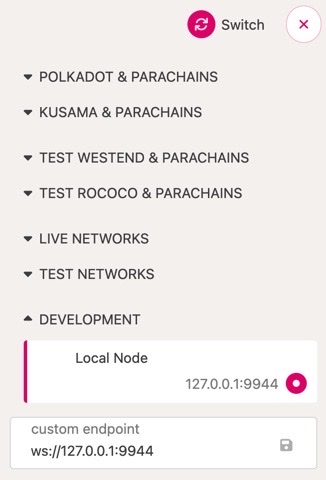

- Click Contracts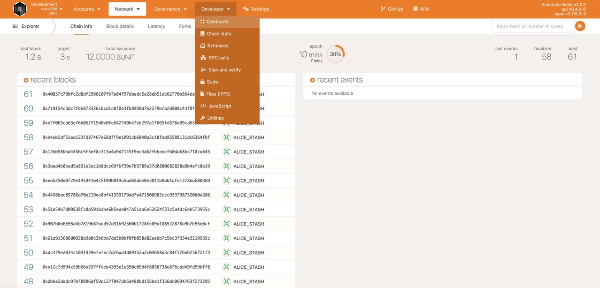
- Click **Upload & deploy code**.

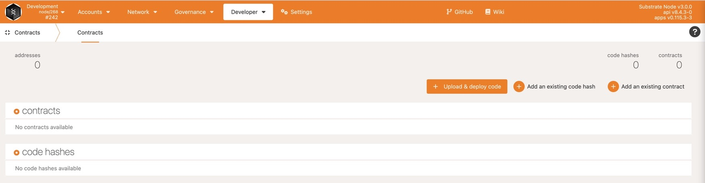

- Select an Account to use to create a contract instance.

Select any existing account, including a predefined account such as alice


- Type a descriptive Name for the smart contract
- Browse and select or drag and drop the `my_psp22.contract` file that contains the bundled Wasm blob and metadata into the upload section.


- Click **Next** to continue.

After you upload the smart contract and click **Next**, the Contracts UI displays information about the content of the smart contract.
To create the instance:
Review and accept the default Deployment Constructor options for the initial version of the smart contract.
Review and accept the default Max Gas Allowed of `200000`.

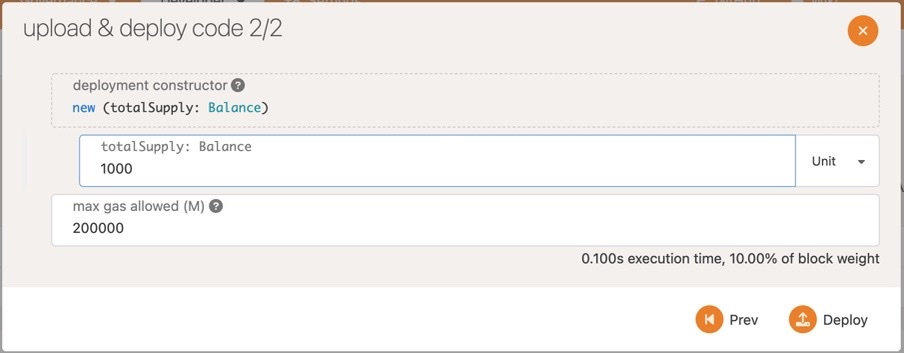

- Click **Deploy**.
  The transaction is now queued. If you needed to make changes, you could click Go Back to modify the input.

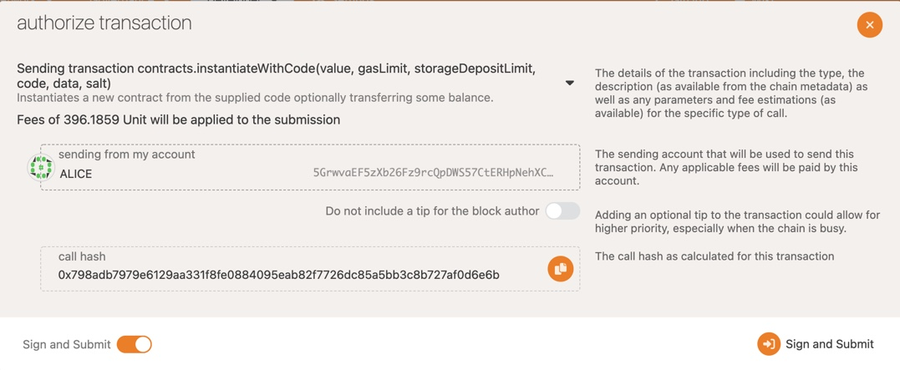

- Click **Sign and Submit**.

Depending on the account you used, you might be prompted for the account password. If you used a predefined account, you won’t need to provide a password.

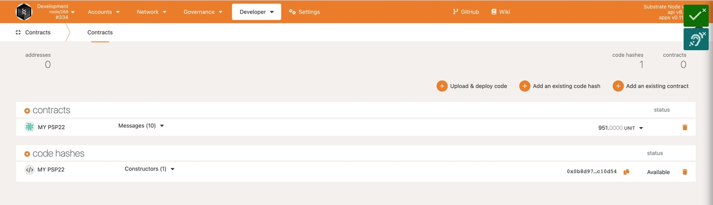

### Call the smart contract

Now that your contract has been deployed on the blockchain, you can interact with it. The default flipper smart contract has  functions — `totalSupply()` and `balanceOf()` — and you can use the Contracts UI to try them out.

To test the `balanceOf()` function:

Select any account from the Account list.

This contract doesn’t place restrictions on who is allowed to send the `balanceOf()` request.

- Click **Read**.
  Verify that the value `1,000,000,000,000,000` is returned in the Call Results.

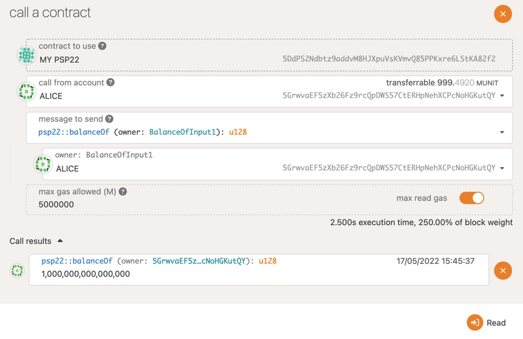

### Rococo Faucet

**Canvas** - parachain on **Rococo** ‒ a testnet for **Polkadot and Kusama parachains**.
As a first step, you should create an account. [See here for a detailed guide.](https://wiki.polkadot.network/docs/learn-account-generation)

As a second step, you have to get `ROC` testnet tokens through the [Rococo Faucet](https://wiki.polkadot.network/docs/learn-DOT#getting-rococo-tokens). This is a chat room in which you need to write:

`!drip YOUR_SS_58_ADDRESS:1002`

send message to [#rococo-faucet:matrix.org](https://matrix.to/#/#rococo-faucet:matrix.org)

The number `1002` is the parachain id of **Canvas on Rococo**, by supplying it the faucet will teleport `ROC` tokens directly to your account on the parachain

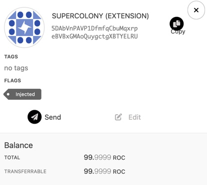

### Deploy to Canvas

- Navigate to the [Contracts UI](https://paritytech.github.io/contracts-ui) in a web browser.
- Verify that you are connected to the **Canvas Node**.


- Upload `my_psp22.contract` file the same way as to local node but we need some `ROC` tokens
- Use wallet which contains `ROC` tokens

### Astar

* **Astar** - Astar is a multi-chain smart contract platform that supports multiple
  blockchains and virtual machines.
* **Astar/Shiden Network Family:**
  Before starting the deployment, it's important to understand Astar/Shiden Network family. You should change the network based on what you want to do. Currently, there are 3 networks available, **Shiden**, **Shibuya**, and **Local** network. All networks support own standard Substrate RPC and EVM RPC.
* **Astar and Shiden**:
  Astar is the network that aims to be the parachain of Polkadot. Shiden is the sister network of Astar which is the parachain of Kusama. Basically, Astar and Shiden share the same code base. The biggest difference is the economic impact.

Please note that Shiden has its real economic value. So you need to pay in SDN, the native token of Shiden, when you execute transactions. You can buy SDN on crypto exchanges.

* **Shibuya**:
  Shibuya is the test network of Shiden and is connected to our own Relaychain. So Shibuya behaves almost the same as Shiden. Any new features are tested on Shibuya first and then deployed on Shiden. SBY, the native token of Shibuya, has no economic value and is available through our [faucet](https://docs.astar.network/integration/testnet-faucet). The best practice is to testing smart contract on Shibuya before deploying it on Shiden to check whether your smart contract works well or not.
* **Astar local Network**:
  Here is [tutorial](https://docs.astar.network/tutorial/develop-and-deploy-your-first-smart-contract-on-aster-shiden-evm/running-local-network) how to run local network

### Deploy to Shibuya

- Build smart contract the same way as for [local node](#Build)
- Create an **Astar** [wallet](https://docs.astar.network/stake2earn-festival/how-to-make-a-kusama-polkadot-address#recommend-polkadot-.js-browser-plugin)
- **Faucet**. get free **SBY** [token](https://docs.astar.network/integration/testnet-faucet)
- Go to [polkadot.js.org](https://polkadot.js.org/apps/?rpc=wss%3A%2F%2Frpc.shibuya.astar.network#/explorer)
- Switch network

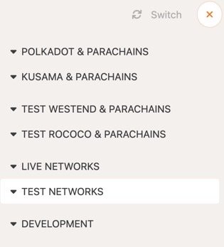

- Select **Shibuya** network

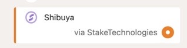

- Deploying the smart contract:

Under the Developer tab, select Contracts then click on the **Upload & deploy code** button. Look for your `metadata.json` and `my_psp22.wasm`

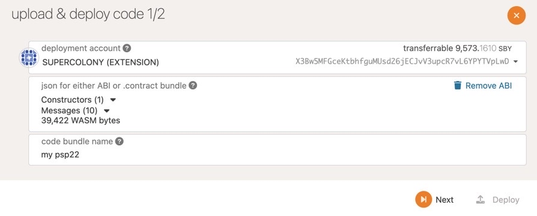

- Set value for deployment contructor:

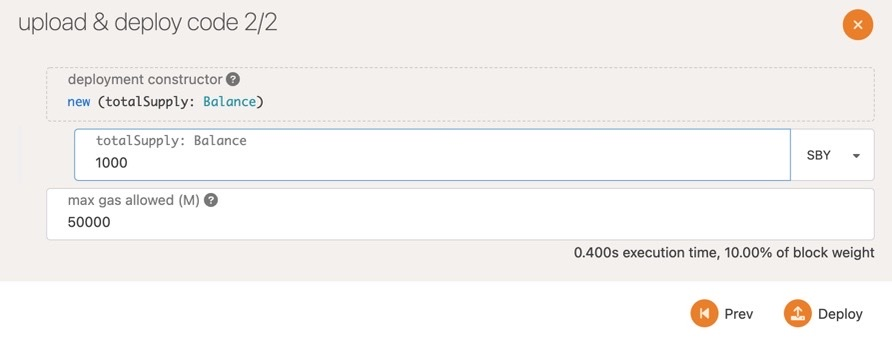

- Click **Deploy**.

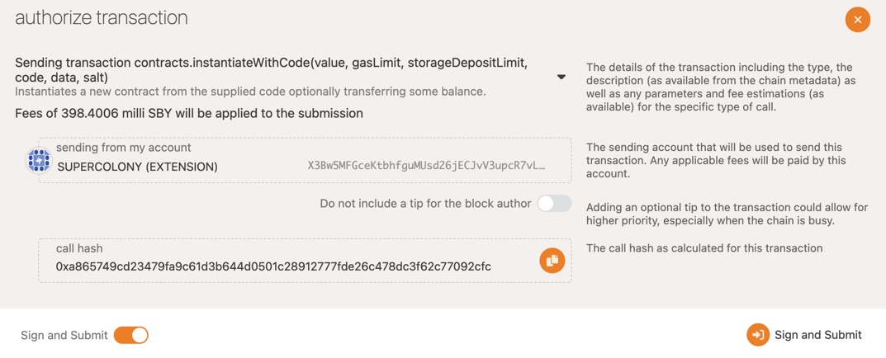

- Finally, click on the **Sign and Submit** button to deploy your contract.

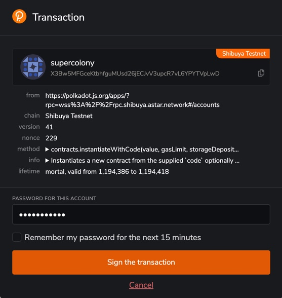

You can see MY PSP22 smart contract deployed to Shibuya network

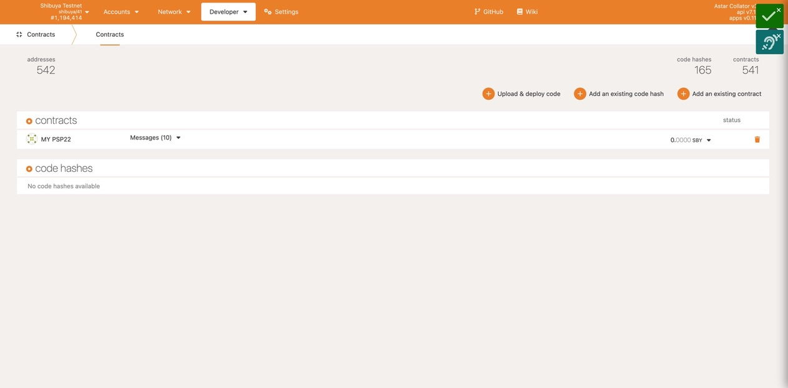

We use **“messages”** to communicate with smart contracts.
There are 2 types of messages:

- messages that change a smart contract’s state should be sent as transactions
- messages that don’t change a state can be made by using RPC calls

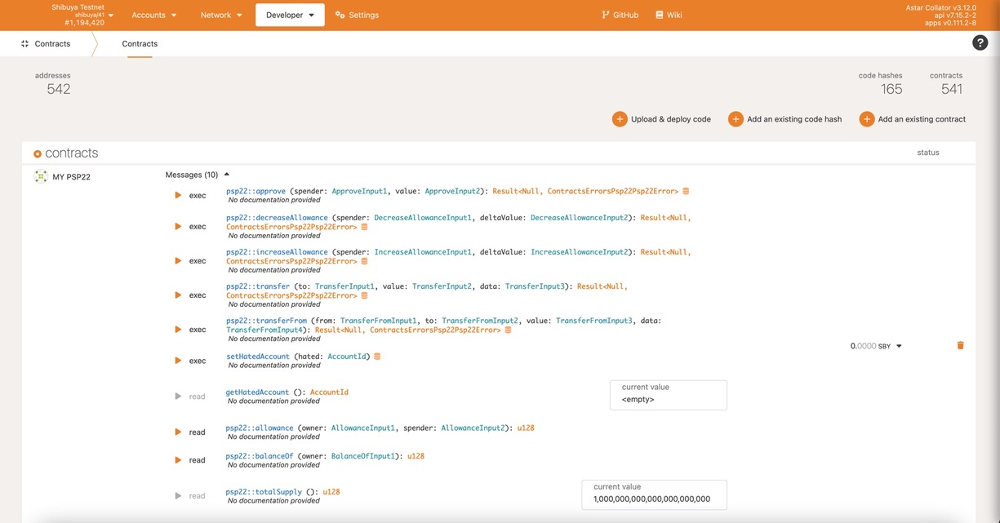

Next, let’s change the smart contract state by sending a transaction that calls the `transfer()` function.

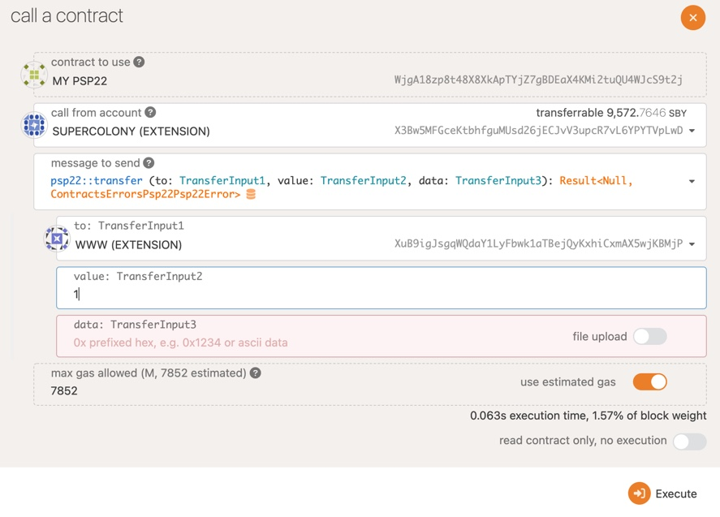

- Sign the transaction

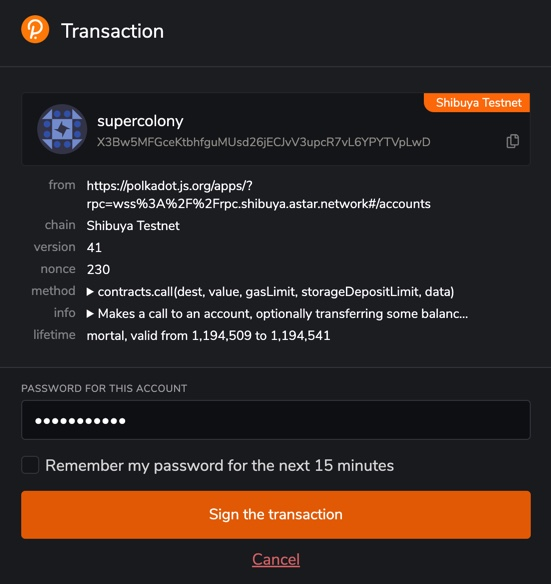

As expected, the value that was stored in the smart contract changed from `0` to `1` after the `transfer()` transaction is successfully executed

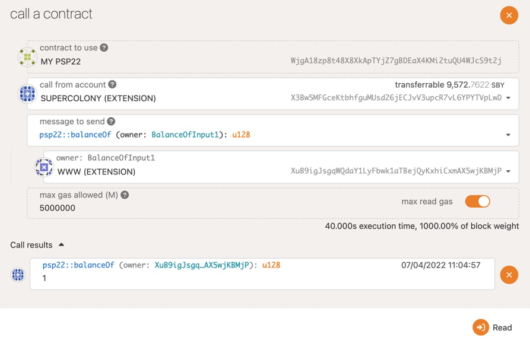

Congratulations, you deployed and test your first L1 Smart Contract to **Shibuya** network!
