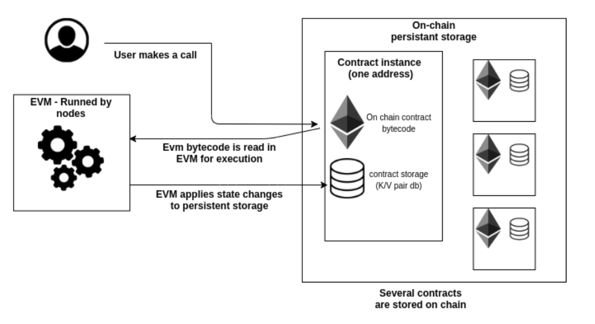

This short article describes differences between EVM Smart Contracts & Substrate WASM Smart contracts.

## EVM

### Background
Ethereum was the first Turing-complete blockchain and was mainly developed because of limitations of Bitcoin's script. In order to execute smart contracts, a sandbox environment is needed. The sandbox environment where Smart contracts are executed in Ethereum is the  **Ethereum virtual machine** (*EVM*)

### Bytecode
EVM uses a stack-based bytecode language called EVM bytecode. EVM bytecode is a series of OP_CODEs (instructions) that are executed by the EVM. These OP_CODEs offer rather limited instructions compared to a full-blown language (Java, WASM, ..)

The primitive of the bytecode is *256-bit* integer, which can be a big limitation, as it is needed to use *256-bit* integers to do calculations on even small numbers. Moreover, it will take 256 bits of memory for any value that is stored in persistent storage.

The main OP_CODEs are **SLOAD** to load data, **SSTORE** to write a *256-bit* integer to storage and **CALL** to call another contract [full list of OP_CODES](https://github.com/crytic/evm-opcodes). It's via these instructions that EVMs interact with the chain.

### Gas model
The incentive model of interacting with EVM is gas. It acts like a fee that is calculated for each instruction someone executes. Every instruction has a certain pre-calculated fee amount, and the total gas spent is the sum of all the instructions that were executed.

Please check the entire table of [fees](https://blockgeeks.com/wp-content/uploads/2018/03/image2-2.png)
A gas fee is only due when interacting with EVM. There is no charge for the space you are using for storage, and it results in having a ton of dead code (or non-used contracts) stay on Ethereum chain forever.

### Evm process

## Substrate Contract-Pallet

### Intro
`pallet-contract` is a module in Substrate (the framework to build blockchain on `Polkadot`). Its purpose is a sandbox environment, which provides WASM interpreter and allows executing WASM smart contracts.

### WASM interpreter

At the moment, contract pallet uses [wasmi](https://github.com/paritytech/wasmi) as the interpreter. Wasmi is a pure interpreter-type WASM virtual machine. It is used because execution of smart contract needs a high degree of correctness.

### Storage rent & Gas

In order to incentive the deletion of unused code on chain, pallet-contract implemented a storage-rent principle.  

Every smart contract will have a rent to pay for its code and on-chain storage (small amount at every block). When the smart contract fails to pay the rent, the contract will become a Tombstone (its storage will be deleted).

The gas system of ethereum (price depending on the complexity of the computation) is still present in Substrate, but the gas is charged after the call is executed, as it is basically a fee on the time of execution (the more time it takes for the node to execute a call, the more caller will pay). The `pallet-contract` defines the [amount of gas](https://substrate.dev/docs/en/knowledgebase/smart-contracts/contracts-pallet)

### Contract code & instance are decoupled

Even though `pallet-contract` uses an account model for its contracts (like ethereum does), there is still one big difference:

When you deploy a WASM smart contract, it will only create a hash of the WASM code, meaning that this contract will have no address, nor will it have some associated storage (so it is impossible to interact with this contract). In Ethereum, though, every contract code deployed on chain has a unique address (instance) and its associated storage.

After the WASM hash is deployed, one can create as many instances of this contract as they want. Each instance will have a unique address to interact with, as well as its own associated storage.

Why is it useful:
- Different contract instances with different **constructor parameters** can be instantiated using the same uploaded code, which reduces the space needed on chain to store WASM code
- Storage and balance are decoupled from contract code logic, which provides ability **patch or upgrade** the underlying contract code

## EVM vs contract-pallet

- Common point: they both are a sandbox to execute smart contracts
- The engine which executes contracts is different. In Ethereum, as it was the first blockchain to implement a sandbox environment, it is rather limited and slow, compared to a wasm interpreter
  Storage rent has been introduced in contract-pallet to incentivize the deletion of unused code
- Contract pallet integrates a [two-step-deployment](https://substrate.dev/docs/en/knowledgebase/smart-contracts/contracts-pallet#two-step-deployment) to decouple contract code and contract instances

## Comparing WASM Smart contracts to EVM smart contracts

- WASM is broadly adopted, while EVM bytecode is only used in EVMs -> There is way more tools available for WASM development
- EVM bytecode can only be compiled from Solidity or Vyper, while WASM can be compiled from a lot of Popular languages (Rust, C/C++, C#, Java, Typescript, Haxe, Kotlin and even from Solidity)
- Excellent integration of Rust to compile in WASM
- Lightweight: it produces lightweight binaries that can ship easily
- performance near native code (2x faster than Javascipt)
- Continually developed by major companies such as Google, Apple, Microsoft, Mozilla, and Facebook.

[more info here](https://paritytech.github.io/ink-docs/why-webassembly-for-smart-contracts)