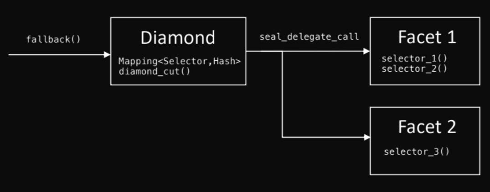

# Upgradeable contract

## Overview

Smart contracts are immutable by default, adding a layer of security and trust to the 
contracts. But software quality depends on the ability to upgrade source code to 
produce iterative releases. A certain degree of mutability is needed for bug fixing 
and potential product improvements.

Upgradeability allows experimenting and deploying the product at the early stage, 
always leaving the chance to fix vulnerabilities and progressively add features. 
It is more actual right now while ink! and contract-pallet are under active development. 
Upgradeable contracts are not a Bug if they are developed consciously with 
decentralization in mind.

Decentralization can be achieved by providing the right to upgrade only to 
decentralized authority like governance, multisig, or another analog.

It is not hard to upgrade the logic of contracts. It can be achieved via `Proxy` and `Diamond` 
patterns or via the `set_code_hash` function provided by contract-pallet. The hardest 
part is to save the contract's state and make it compatible with new logic.

## Storage layout

### How storage works

Contracts use key-value storage to persist data. Each field of the contract may have 
its key and occupy storage cell. It is called storage layout.


During compilation ink! inserts code to work with storage and ink! knows how to store 
each type in which storage cell. How exactly it works is not a part of this tutorial. 
The main point is that each type knows how to operate with each field and operate with 
storage, because of a unique identifier. In the old version of ink! the identifier is 
`[u8; 32]` in a [new version](https://github.com/paritytech/ink/issues/1134) it is `u32`.

So, each data is stored under its unique identifier - the storage key. The value of the 
key is the sequence of bytes - serialized (by SCALE codec) data type. The logic layer 
knows how to serialize and deserialize each data type. So during the execution, the 
logic layer deserializes all data by their storage keys and returns the 
filled contract's storage variable. The developer works with that variable, and before 
the end of the execution, the logic layer serializes data into sequences of bytes and 
stores them in their storage cells.

### Rules for upgradeable storage layout

The contract can have several logic layers (like in the `Diamond` pattern). 
So we will define rules in terms of several layers, but it is also applicable 
for upgradeable contracts with the `Proxy` pattern or `set_code_hash`.

1. The data stored under the storage key should use the same serialization and 
deserialization mechanism across all logic layers. Otherwise, some logic layers will not 
be able to deserialize the data type and fail.
1. Each logic unit (in most cases, it is a type) should occupy the same storage key across
all logic layers. For example, you have several logic layers that use the 
`Mapping<Owner, Balances>` to track users' balances. You should use the same storage 
key if you want to interact with the same mapping. Otherwise, you will work with different mappings.
1. Each field that occupies some storage key should be used only in its usage flow. 
For example, you have `Mapping<Owner, Balances>` to track users' balances of token 
A in one logic layer. You can't use it in another logic layer to track users' 
balances of token B. Otherwise, one logic layer can overwrite another.

Following those simple rules will save you from corrupting the storage. 
Those rules are applicable for upgraded logic layers too.

If you use the same storage layout across all logic layers, and you don't plan to have 
unique fields per layer(so you don't plan to modify the storage layout in future upgrades). 
Then you already follow those rules with automatically calculated storage keys. 
But if you want to use a unique layout per layer or 
plan to modify the layout in the future, the next section will help you.

### Suggestions on how follow the rules

#### Approach description

The manual setting of the storage key for each field allows following the rules but 
makes development harder. ink! allows you to manually implement all utility traits and 
specify the storage key you want to use for each field. If your contract has 20 fields, 
then you need to set 20 storage keys.

The main suggestion is to design your storage layout as a bunch of logic units and 
assign a unique storage key to logic unit. The logic unit can be one field or a bunch 
of fields. In the scope of the logic unit, you can use automatically calculated keys 
offset with the storage key of the logic unit, or you can use the same approach 
again and split logic into more units.

With this approach, you can order your units as you wish. You can add/remove/swap 
logic units and don't worry about storage layout because each logic unit will have its space 
in the blockchain's storage. If storage keys are unique, those spaces don't overlap.

OpenBrush provides [`openbrush::upgradeable_storage`](https://github.com/Supercolony-net/openbrush-contracts/blob/main/lang/macro/src/lib.rs#L447) 
attribute macro that implements all required traits with specified storage key(storage key is required input argument to macro). 
Also, macro initializes the field with a default value if the field is not initialized before
(it can be actual during the upgrade because new fields are not initialized yet).
You can use that macro to define a logic unit.

> **Note**: Each logic unit should have a unique storage key.
The storage key should be used only once in the contract.
Those two requirements mean that your type(logic unit) can be used only once in the contract. For example,
`psp22::Data` is a logic unit. You can have only one field of that type. 
If you have several fields with that type, you will use the same storage 
key several times, which is a collision.

#### Logic unit per business use case

You can include all fields into logic unit, like this:
```rust
#[openbrush::upgradeable_storage(0x123)]
pub struct Data {
    balances: Mapping<Owner, Balance>,
    total_owners: u128,
}
```

It makes your code readable and segregated by business logic. 
But it will add some limitations to future upgrades.

##### Limitations for future upgrades

Each field that doesn't have a separate space in the storage almost always depends 
on the field ordering(and maybe naming if you use a new ink!). So you can't remove 
fields or change the ordering(and naming). 

But you can add new fields. For that, you can reserve one field with empty type `Option<()>` 
in your contract for future type.

```rust
#[openbrush::upgradeable_storage(0x123)]
pub struct Data {
    balances: Mapping<Owner, Balance>,
    total_owners: u128,
    _reserved: Option<()>,
}
```

The default value of that field is `None`. But in the future, you can init it with some useful type and value.

```rust
#[openbrush::upgradeable_storage(0x123)]
pub struct Data {
    balances: Mapping<Owner, Balance>,
    total_owners: u128,
    _reserved: Option<DataExtend>,
}

impl Data {
    fn extension(&mut self) -> &mut DataExtension {
        &mut self._reserved.unwrap_or_default()
    }
}

#[derive(Default)]
pub struct DataExtension {
  owners_blacklist: Mapping<Owner, ()>,
  _reserved: Option<()>,
}
```

So if you modify your contract many times in the future,
it can cause a deep stack of `_reserved` fields, or many dead fields.
You can always create a new logic unit and embed the old one. So you should decide what 
is better for you right now. Create a new logic unit that will include the old one, 
or add a new field into the current.

#### Logic unit per each field

You can create a unique type for each field like:

```rust
#[openbrush::upgradeable_storage(0x123)]
pub struct Balances(openbrush::storage::Mapping<AccountId, Balance>);

#[openbrush::upgradeable_storage(0x124)]
pub struct TotalOwners(u128);
```

You have no limitations, but you made your code harder to read, 
and maybe you have a lot of unique structures :D

#### Unique storage key

The storage key should be unique per each logic unit. You can assign each key manually or 
use some hash function to automate it.

OpenBrush provides [`openbrush::storage_unique_key!`](https://github.com/Supercolony-net/openbrush-contracts/blob/main/lang/src/macros.rs#L25) 
macro that generates a storage key based on the path to the structure. 
It has one required input argument - the name of the structure.

```rust
#[openbrush::upgradeable_storage(openbrush::storage_unique_key!(Data))]
pub struct Data {
    balances: Mapping<Owner, Balance>,
    total_owners: u128,
    _reserved: Option<()>,
}
```

or 

```rust
pub const STORAGE_KEY: u32 = openbrush::storage_unique_key!(Data);

#[openbrush::upgradeable_storage(STORAGE_KEY)]
pub struct Data {
    balances: Mapping<Owner, Balance>,
    total_owners: u128,
    _reserved: Option<()>,
}
```

## Constructor and initialization

Uploading your contract on the blockchain with `contract-pallet` has two phases:
- Deploy - deploys source code to the blockchain. After deploying, the network uses the hash of the source code as an identifier for future instantiation of the contract. Now anyone can instantiate the contract by source code hash.
- Instantiation - creates the instance of the contract on the blockchain that uses source code by its hash. After that, anyone can interact with the contract.

So, deploy - uploading a logic layer to the blockchain; instantiation - reservation of 
the storage that belongs to the contract and creation of the entity to 
interact(contract with `AccountId`) with that storage via logic layers.

Each logic layer can require initialization to set up initial variables for correct 
work. In the typical scenario, when the contract is not upgradeable, you have only 
one logic layer, which should be initialized only once during the instantiation of 
the contract. It is called a constructor. You still can have several constructors, 
but you can call only one during instantiation.

Constructors can still be used to initialize upgradeable contracts that use the 
`set_code_hash` function. But that approach doesn't work for logic layers of 
`Proxy` and `Diamond` patterns.

### Initialization method

`Proxy` and `Diamond` pattern contracts have their constructor but only initialize 
variables related to forwarding calls to corresponding logic layers.

#### Delegate call

Those contracts use [`delegate_call`](https://github.com/paritytech/substrate/issues/10566) to forward calls to logic layers. 
The delegate call accepts the logic layer's code hash and executes the source code, corresponding to the hash, 
in the context of the current contract. The source code works with the current contract state in that case. 
You can't call the constructor during a delegate call, so you can't naturally initialize the contract.

#### Workaround

Instead of using the constructors as the primary way to initialize the logic 
units(each logic layer has its logic unit or a bunch of logic units), 
you can add a separate initializer method and leave the constructor empty(with 
resolving [issue](https://github.com/paritytech/ink/issues/1187) you can not 
have constructor at all). That initialize method can accept any arguments the 
same as a typical constructor.

For example, for an upgradeable `PSP22` contract, you can add the `init_with_supply` method:

```rust
#[ink(message)]
pub fn init_with_supply(&mut self, total_supply: Balance) -> Result<(), PSP22Error> {
    self._mint_to(Self::env().caller(), total_supply)
}
```

You can add as many methods as you wish with any arguments (the same as constructors).
The problem is that anyone can call all those methods unlimited times when the 
constructor can be called once by the creator of the contract. 
In most cases, you want the same behavior as a constructor.
So you need to add the check that initialization already was called and 
restrict the set of people that can do that.

#### Initialization state per logic unit

Each logic unit can store boolean variable that shows the state of initialization.

```rust
#[ink(message)]
pub fn init_with_supply(&mut self, total_supply: Balance) -> Result<(), PSP22Error> {
    if self.initialized {
        return Err(PSP22Error::Custom(String::from("Already initialized")));
    }
    self._mint_to(Self::env().caller(), total_supply)
}
```

#### Permission to initialize

Also, you can use some logic to manage permission. In an upgradeable contract, 
you should already use some logic to manage upgrades. You can reuse it here.
If you use `Ownable` then the code can look like this:

```rust
#[ink(message)]
#[openbrush::modifiers(only_owner)]
pub fn init_with_supply(&mut self, total_supply: Balance) -> Result<(), PSP22Error> {
    if self.initialized {
        return Err(PSP22Error::Custom(String::from("Already initialized")));
    }
    self._mint_to(Self::env().caller(), total_supply)
}
```

OpenBrush doesn't provide any utils for initialization right now because, 
in most cases, you have a unique way to initialize the contract.
OpenBrush team doesn't want to add overhead - boolean variables per logic unit.

But for managing the permission, you can use `Ownable` or `AccessControl` default implementation.

### Small optimization for all upgradeable contract

Most contracts require initialization, but in most cases, only once. 
After initialization, you can always upgrade your contract and exclude the 
initialization logic. It will make your contracts safer, improve performance, 
and reduce gas consumption.

## Types of upgradeable contracts

There are 3 types of Upgradeable contract.

1. **Proxy** pattern
  * Pros
    * Basic pattern where it's hard to introduce a bug
  * Cons
    * Necessity to deploy extra contract and additional overhead for every singe call
2. Usage of **set_code_hash** method
  * Pros
    * Easy to make your contract upgradeable, you only need to expose the `set_code_hash` method
  * Cons
    * If you forget to expose it during the update, you will lose the ability to do upgrades
3. **Diamond standard** pattern
  * Pros
    * Allows splitting your contract on facets(logic layers) to optimize performance of your contract and overcome contract size limits
    * Allows upgrading facets(logic layers) separately and use different governance rules per logic layer
  * Cons
    * More overhead for particular overlapping logic units
    * More likely to break the storage
    * Requires good deploy management

### The `Proxy` Pattern

`Proxy` pattern has two contracts. The first contract is a simple wrapper - 
a "proxy" that users interact with directly and is in charge of forwarding calls to 
the second contract - the logic layer. The logic layer can be replaced while the proxy 
can not. To upgrade the logic layer, you must replace the code hash of logic layer with a new one.

The proxy contract is not upgradeable and straightforward. You can reuse implementation from OpenBrush to create your proxy.
The logic layer is better to follow the rules described above.

This is the illustration how `Proxy` contract with delegate_call looks like:


OpenBrush provides default implementation for `Proxy` pattern.
It has `proxy::Data` logic unit that stores `forward_to` inside.
The storage unit occupies the `proxy::STORAGE_KEY` storage key.
The `forward_to` is the code hash of the logic layer's source code. It also contains
`change_delegate_call` method to update code hash for `forward_to` value inside
the contract. Only the owner is able to call the `change_delegate_call` method.

```rust
pub const STORAGE_KEY: u32 = openbrush::storage_unique_key!(Data);

#[derive(Default, Debug)]
#[openbrush::storage(STORAGE_KEY)]
pub struct Data {
    pub forward_to: Hash,
}
```

For more details on how to reuse the default `Proxy` implementation, you can check [Proxy](proxy.md).

The logic layer for `Proxy` is the same as the definition of the facet for the `Diamond` 
contract, but you have only one facet. You can read about it in [that section](#logic-units-for-facet). 

### Usage of `set_code_hash` method

ink! has the `ink::env::set_code_hash` method, which allows replacing the code hash 
of the current contract. So you can change the logic layer by specifying a new code 
hash on demand. After setting a new code hash, the next call to your contract will execute updated logic.

You only need to expose that method somehow, and your common contract is upgradeable.
For example, you can add that method, and it is done:

```rust
#[ink(message)]
pub fn upgrade_my_contract(&mut self, new_code_hash: Hash) {
    ink::env::set_code_hash(&new_code_hash)
}
```

You need to consider the permission system because only a restricted set of people 
should be able to call that function.

All suggestions described above are applicable for that kind of upgradeable contracts. 
Better to have an upgradeable storage layout, initialization function for new versions 
of your contract, permission system, etc.

### The `Diamond` Standard

Using `Diamond` Standard you can add support for several facets(logic layers) that 
can be upgraded. [This standard](https://eips.ethereum.org/EIPS/eip-2535) came 
from the ethereum network. It works in the same way in ink! but instead of the 
address of the logic layer, you need to use the code hash of the logic layer.

This is the illustration of the flow of the `Diamond` pattern:



Each method in the smart contract has a selector. It is used as an identifier during the 
smart contract call to execute the right logic.
Each facet has a list of selectors that describe which methods are supported by the facet. 
Each selector is unique and belongs only to one facet. So selectors of facets can't overlap. 
`Diamond` contract knows which facet is responsible for which selector and forwards each 
call to the smart contract to the corresponding facet (logic layer).
`Diamond` contract has a function `diamond_cut` that allows registering each facet.

OpenBrush provides default implementation for `Diamond` standard on ink!.
For more details you can check [Diamond](diamond/diamond.md).

All suggestions above ideally describe how to develop an upgradeable contract
with multi-logic layers and many logic units.
So here we will describe how to write facets (logic layers) with OpenBrush.

#### Logic units for facet

Each facet (logic layer) can have zero, one, or many logic units that work 
with storage.

Each logic unit should have a unique storage key and be upgradeable (support initialization
on demand, use storage key as an offset for all inner fields). It can be a struct with 
one or many fields (structs without fields are useless) or an enum with at least two 
variants (an enum with one variant is a structure). You can define struct/enum with the 
`openbrush::upgradeable_storage` macro and have an independent logic unit. You can 
create several units and combine them into one contract.

> **Note**: If your contract has at least one field that is not defined with the 
`openbrush::upgradeable_storage`, it will fail during execution. Each field should be 
upgradeable in the facet.

As an example, we will define logic units for `PSP22` and `Ownable` facets.

```rust
// OpenBrush uses the same logic unit for the default implementation of the `PSP22` trait.
#[openbrush::upgradeable_storage(openbrush::storage_unique_key!(PSP22Data))]
pub struct PSP22Data {
    // Total supply of the `PSP22`
    pub supply: Balance,
    // Balance of each user
    pub balances: Mapping<AccountId, Balance>,
    // Allowance to send tokens from one user to another
    pub allowances: Mapping<(AccountId, AccountId), Balance>,
    // Reserved fields for future upgrades
    pub _reserved: Option<()>,
}

// OpenBrush uses the same logic unit for the default implementation of the `Ownable` trait.
// It simply stores the `AccountId` of the owner of the contract.
#[openbrush::upgradeable_storage(openbrush::storage_unique_key!(OwnableData))]
pub struct OwnableData {
    // Owner of the contract
    pub owner: AccountId,
    // Reserved fields for future upgrades
    pub _reserved: Option<()>,
}
```

`PSP22Data` and `OwnableData` have their storage keys. Both contain an additional field 
unrelated to business logic `_reserved` for future upgrades(it adds overhead in one byte).

#### Definition of the facet (logic layer)

The definition of the facet is the same as the definition of the contract. You need 
to combine your logic units in the contract as fields. Leave the constructor empty, 
add the initialization method and methods related to business logic.

Example uses logic units defined in the previous section.

```rust
#[openbrush::contract]
pub mod facet_a {
    ...

    #[ink(storage)]
    pub struct FacetA {
        psp22: PSP22Data,
        ownable: OwnableData,
    }
    
    // Your own implementation of `PSP22` trait.
    impl PSP22 for FacetA {
        ...
        
        #[ink(message)]
        fn balance_of(&self, owner: AccountId) -> Balance {
            ...
        }
    }

    impl FacetA {
        #[ink(constructor)]
        pub fn new() -> Self {
            // Empty constructor, we do here nothing
            ink_lang::codegen::initialize_contract(|instance: &mut Self| {})
        }

        // Initialization method to grant `total_supply` tokens to someone.
        #[ink(message)]
        pub fn init_with_supply(&mut self, total_supply: Balance) {
            assert_eq!(Self::env().caller(), self.ownable.owner, "Only owner can init contract");
            ...
        }
    }
}
```

You can deploy the code of the facet to the blockchain. After that, you can 
register your facet in `Diamond` via the `diamond_cut` method or in `Proxy` via 
`change_delegate_call` method.

#### Interaction between facets

During development, you can have cases when one logic layer (for example `FacetA`) needs to interact with 
another logic unit or logic layer (for example `FacetB`). 
You have two options for how to do that:

1. The contract can send a cross-contract call to itself and execute the public function(method marked with `#[ink(message)]`) of your contract.
1. Embed logic unit into your contract what you want to use into another facet and interact with it.

##### Cross-contract call to itself

If your `FacetA` implements some trait, then you can use the 
[wrapper around trait](https://github.com/Supercolony-net/openbrush-contracts#wrapper-around-traits) 
feature of OpenBrush to do cross-contract call.

> **Note**: The trait should be defined with `openbrush::trait_definition`.

```rust
#[openbrush::contract]
pub mod facet_b {
    ...
    
    impl FacetB {
        ...


        #[ink(message)]
        fn balance_of_owner_in_facet_a(&self, owner: AccountId) -> Balance {
            let address_of_current_contract = Self::env().account_id();
            // It does a cross-contract call to itself with `owner` as an argument.
            // It needs to allow reentrancy if it wants to execute itself.
            PSP22Ref::balance_of_builder(&address_of_current_contract, owner)
                .call_flags(ink::env::CallFlags::default().set_allow_reentry(true))
                .fire()
                .unwrap();

        }
    }
}
```

The important thing is that you should allow reentrancy during that call.
You can also import the code of `FacetA` and use the native `Ref` feature for 
cross-contract calls of ink!.

Better to avoid the usage of cross-contract calls and work directly with the logic unit. 
But it depends on the complexity of the logic layer.

##### Embed logic unit

If you use OpenBrush and follow suggestions above, your logic units are independent.
It allows you to embed any logic unit into any facet(logic layer) without corruption of the storage.

```rust
#[openbrush::contract]
pub mod facet_b {
    ...

    #[ink(storage)]
    pub struct FacetB {
        // You embed `PSP22Data` logic unit from `FacetA`. 
        // It works with the same storage as `FacetA`. 
        // So you have access to data of `FacetA`.
        psp22: PSP22Data,
        // Some data for `FacetB`.
        foo: BarData,
    }

    impl FacetB {
        #[ink(constructor)]
        pub fn new() -> Self {
            // Empty constructor, we do here nothing
            ink_lang::codegen::initialize_contract(|instance: &mut Self| {})
        }

        #[ink(message)]
        fn balance_of_owner_in_facet_a(&self, owner: AccountId) -> Balance {
            // It accesses to the balance of `owner` that is managed by `FacetA`.
            self.psp22.balances.get(&owner).unwrap_or_default()
        }
    }
}
```

Embedding of the logic unit grants access to its storage.

##### Remark about logic units and OpenBrush

All data structures for contracts provided by OpenBrush are upgradeable logic units. 
So contracts support upgradeability by default.

You can access the default implementation when you embed OpenBrush data structures 
into your contract. You can use default implementation internally, or you can make 
it public.

For example, when you embed `psp22::Data` into your `Contract`, you can already 
internally use the methods of the `PSP22` trait. Implementation of the `PSP22` makes your method public.

```rust
impl PSP22 for Contract {} // That line makes your method publicly available.
```

So, if you embed `psp22:Data` in your `FacetB` contract. Then you can call `self.balance_of(owner)` and it will use the default implementation without a cross-contract call.

```rust
// Code of facet A
#[openbrush::contract]
pub mod facet_a {
    use openbrush::contracts::psp22::*;
    use openbrush::contracts::ownable::*;
    ...

    #[ink(storage)]
    pub struct FacetA {
        psp22: psp22::Data,
        ownable: ownable::Data,
    }

    impl PSP22 for FacetA {}

    impl FacetA {
        #[ink(constructor)]
        pub fn new() -> Self {
            // Empty constructor, we do here nothing
            ink_lang::codegen::initialize_contract(|instance: &mut Self| {})
        }

        // Initialization method to grant `total_supply` tokens to someone.
        #[ink(message)]
        pub fn init_with_supply(&mut self, total_supply: Balance) {
            assert_eq!(Self::env().caller(), self.ownable.owner, "Only owner can init contract");
            ...
        }
    }
}

// Code of facet B
#[openbrush::contract]
pub mod facet_b {
    use openbrush::contracts::psp22::*;
    ...

    #[ink(storage)]
    pub struct FacetB {
        // The same logic unit is used in `FacetA`.
        psp22: psp22::Data,
        // Some data for `FacetB`.
        foo: BarData,
    }

    impl FacetB {
        #[ink(constructor)]
        pub fn new() -> Self {
            // Empty constructor, we do here nothing
            ink_lang::codegen::initialize_contract(|instance: &mut Self| {})
        }

        #[ink(message)]
        fn balance_of_owner_in_facet_a(&self, owner: AccountId) -> Balance {
            // Use default implementation for `psp22::Data`.
            // It is not public, because it doesn't have `impl PSP22 for FacetB {}`
            self.balance_of(owner)
        }
        
        ...
    }
}
```