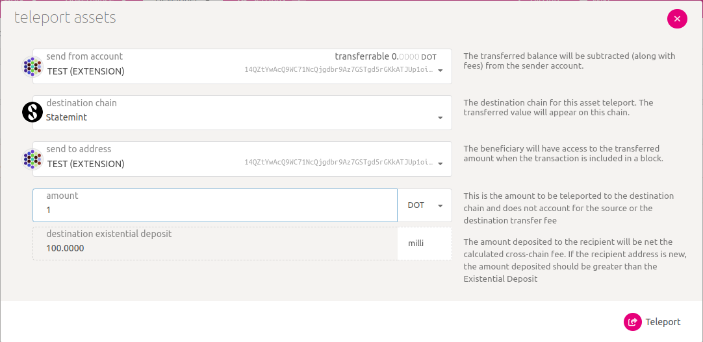
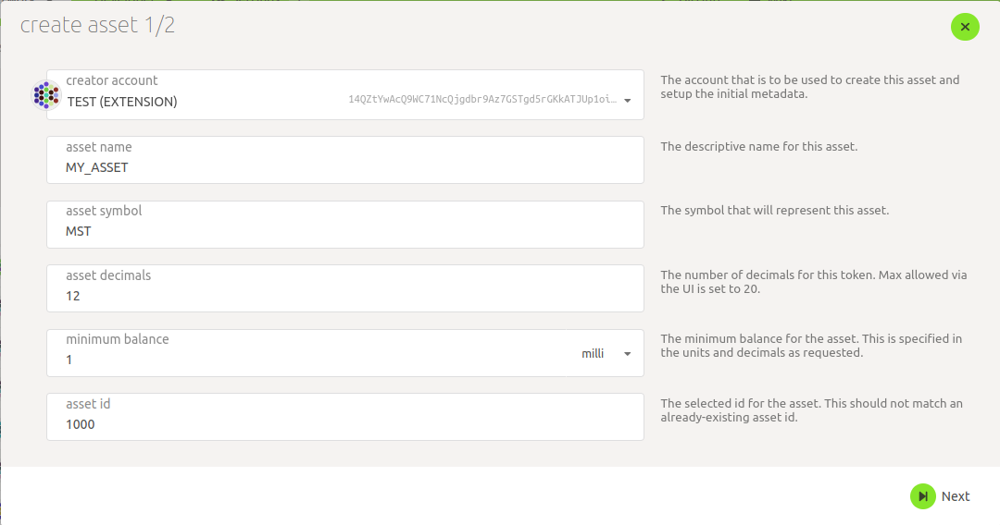
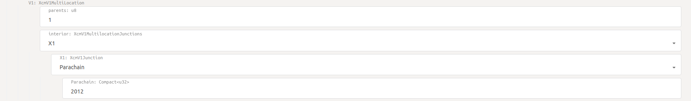
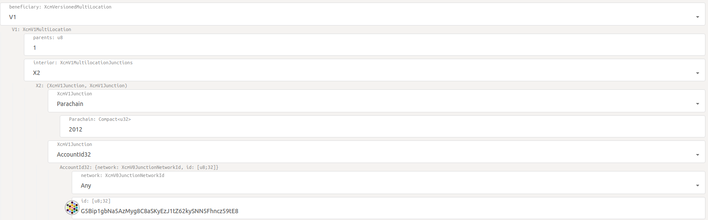
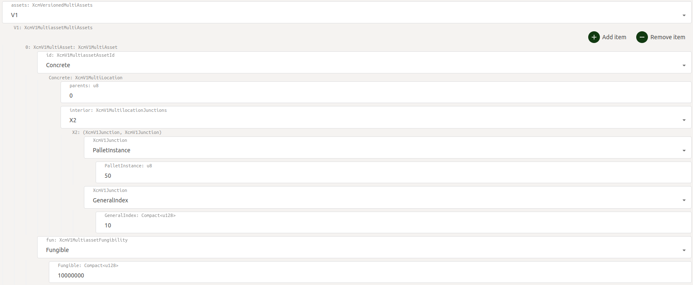
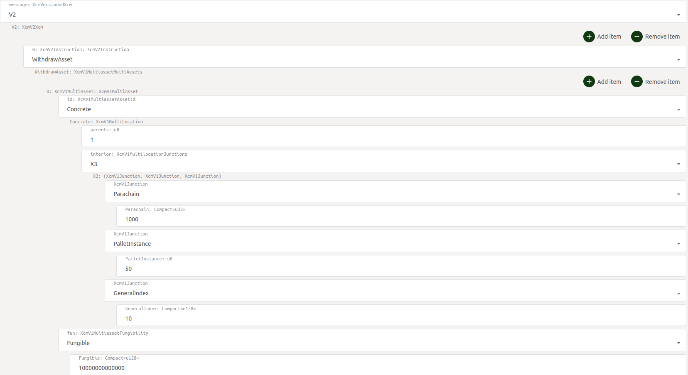
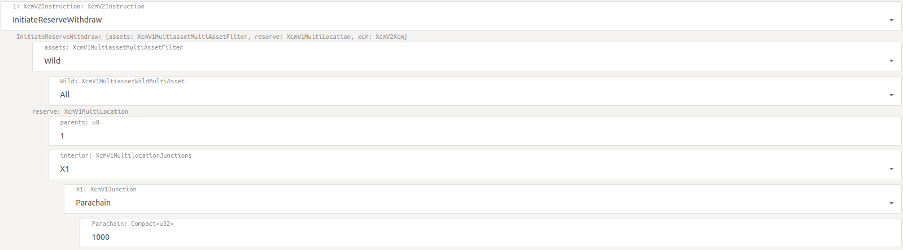
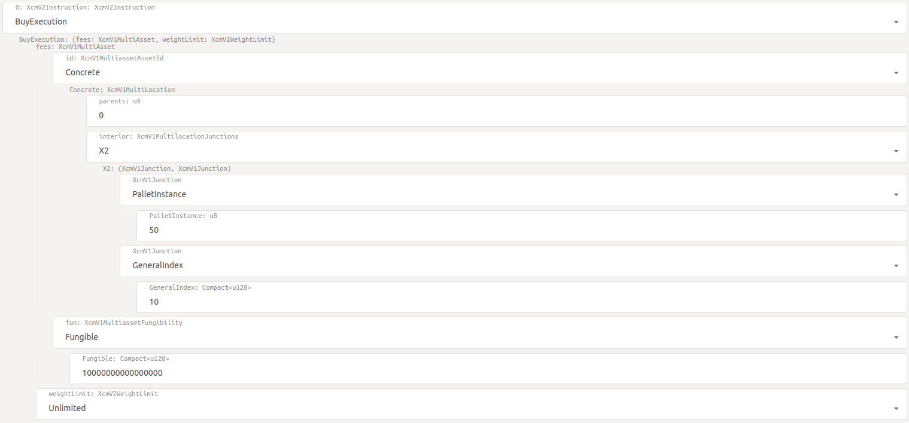
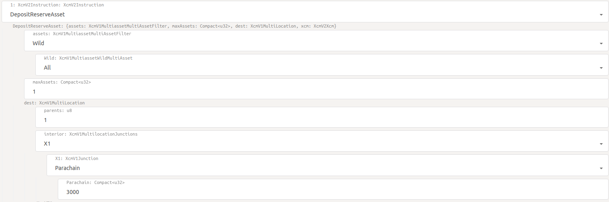
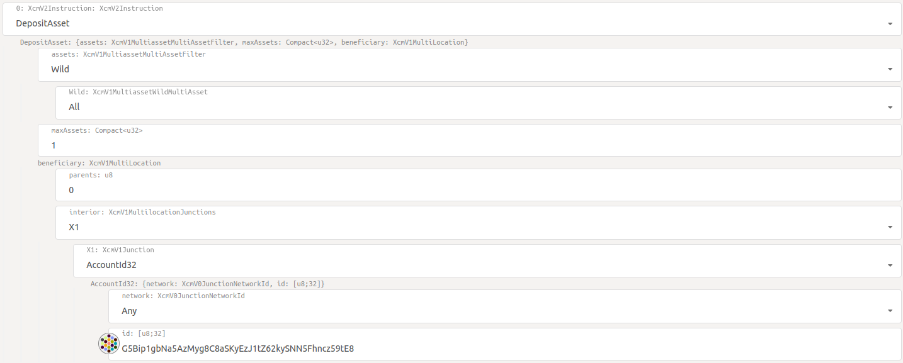

- Using XCM for asset cross-chain transfers

This document contains description of how to create assets and move them between chains

## Some theory =)

### XCM
Polkadot uses XCM(Cross-Consensus Message Format) for communication between parachains and/or relay chain. XCM is actually a format, not a protocol, 
so we can think about it like the language that chains can communicate with.
So, there is 2 message passing protocols: VMP(Vertical Message Passing) and XCMP(Cross-chain Message Passing). There are two kinds of vertical message-passing protocols:
- UMP(Upward Message Passing) - is used to send messages from parachain to relay chain.
- DMP(Downward Message Passing) - is used to send messages from relay chain to parachain.

XCMP allows to send messages directly between parachains, but for now it is in development and Polkadot uses HRMP(Horizontal Relay-routed Message Passing) instead.
HRMP is a temporary solution and will be replaced by XCMP in the future.
HRMP has the same interface, but it stores all the messages on the relay chain, so, the messages are sent from parachain 
to relay chain and then from relay chain to another parachain.

### Teleporting assets

Teleporting assets means that we burn some asset on sender chain and minting them on destination chain.

### Reserve-based transfers

If we want to transfer some assets from one chain to another, we might use third chain as a reserve for such transfers. This way, both assets on sender and destination chains
will be fully backed by corresponding asset on reserve chain. So, when we want to perform transfer operation between these chains, it will work like that:
- Sender chain: burn asset from sender account
- Destination chain: mint asset on destination account
- Reserve chain: transfer asset from sender to destination sovereign accounts.
But every party in this process should trust each other to understand that they will not lose their money and everything will work correctly.

### Statemint

Polkadot has so-called common good parachains Statemint(Polkadot), Statemine(Kusama), Westmint(Westend) and Rockmine(Rococo).
They have the same functionality, just exist on different networks. Statemint(and its sisters) is parachain created for creating and managing assets, 
it can be both fungible or non-fungible tokens. Its native token is DOT, for Statemint it is KSM, for Westmint it is WND and for Rockmine it is ROC.
These parachains are special, as relay chain trusts them and they can be used as reserves for other parachains.

### Locations in XCM

If you are trying to send some XCM messages, you can see such fields like interior and parents. 
Using them you are able to specify the location your message refers to, e.g. if you are on parachain 1000 and your message refers to account on parachain 2000,
it should look like that:
`../Parachain(2000)/AccountId32(0x123...)`
So, this way, parents will be equal to 1, as you are going backwards 1 time, and interior will look like `X2(Parachain(2000)/AccountId32(0x123...))`.

## Transferring assets

### Teleporting assets to account on Statemint

So, at first we should send some tokens to our Statemint account. Fortunately, [PolkadotJS](https://polkadot.js.org/apps) allows us to do it easily.

- Open [PolkadotJS](https://polkadot.js.org/apps) and connect to your relay chain network.
- Go to **Accounts** -> **Teleport**
- Set the destination chain to **Statemint** or your analogue.
- Set the sender address, destination address and amount of tokens you want to send.
- Click **Teleport** button.

### Creating asset on Statemint

- Change the network to **Statemint** or your analogue.
- Go to **Network** -> **Assets**
- Click **Create** button.
- Specify asset's name, symbol, decimals, minimum balance and id(Be sure that id is unique).

- Click **Next** button and specify asset's admin, issuer and freezer.
- Click **Create** button and that's it! Your asset is ready for use.

### Creating derivative assets on other chains

Now you should create derivative assets on other chains as we did it on Statemint, you can change the name or symbol, but other setup should be equal. Also you can use PalletAssets chain extension for it, especially [PSP22Pallet](smart-contracts/PSP22-Pallet/psp22-pallet.md).

### Sending assets from Statemint to parachain

We should send some assets from Statemint to our parachain. We can do it by sending XCM message from Statemint to our parachain.

- Go to **Developer** -> **Extrinsics**
- Select **polkadotXcm** pallet and **reserveTransferAsset** method.

Here we have 3 fields:
- `dest` - destination chain, it should be our parachain.
- `beneficiary` - account on our parachain that will receive assets.
- `assets` - assets that we want to send.

Let's fill them:
- `dest` - we should specify our parachain id, you can find it in **Network** -> **Parachains**.

- `beneficiary` - we should specify our parachain account, you can find it in **Accounts** -> **Accounts**.

- `assets` - we should specify our asset id and amount of assets we want to send.

Now we can click **Submit Transaction** button and wait for the transaction to be included in the block.
Also this asset should be sufficient, that means that we can pay fees for transactions by it and it can create accounts, 
because we can't send assets to accounts that don't have much balance to exist. Sufficiency of asset is defined by governance-mechanism of chain.

### Sending assets between parachains

We should send some assets from our parachain to another parachain. We can do it by sending XCM message from our parachain to another parachain. Also we should remember that 
our reserve chain is Statemint.

- Go to **Developer** -> **Extrinsics**
- Select **polkadotXcm** pallet and **execute** method.

Here we have more complex algorithm:
- Firstly, we want to withdraw asset from our account on Statemint, so we call `WithdrawAsset` instruction and specify how much money we want to withdraw and from where.

- Then we call `InitiateReserveWithdraw` instruction and specify what parachain is our reserve

- Then we want to buy execution time for our message to be executed by calling `BuyExecution` instruction.

- Here we are calling `DepositReserveAsset` instruction and specify on what parachain we want to send our assets.

- Finally, we call `DepositAsset` instruction and specify who will receive assets.

Congratulations! You have successfully created your own asset and transferred it between parachains.